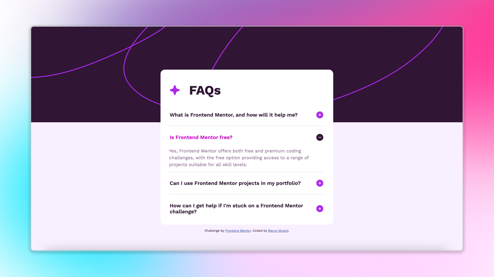
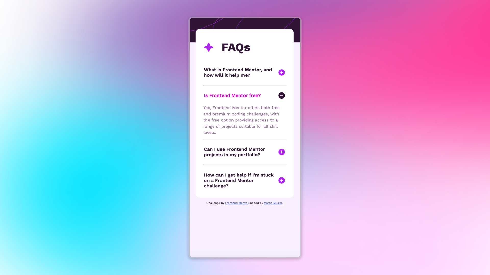

# FAQ Accordion Solution ❓

This is my solution for a [Frontend Mentor Challenge](https://www.frontendmentor.io) – an FAQ Accordion. This project is built using **HTML5**, **CSS**, **Flexbox**, and **JavaScript**.

## 🖼️ Screenshot

## 🌐 Live Demo

Check out the live version here: [Live Site](#) <!-- Replace with your live site link -->

## 📂 Project Overview

The FAQ Accordion allows users to toggle the visibility of answers by clicking on questions. It also supports keyboard navigation for accessibility.

### Features ✨

- Responsive layout using Flexbox
- Dynamic content display with JavaScript
- Keyboard navigable FAQ section for improved accessibility
- Smooth animations for toggling FAQ items

## 🛠️ Built With

- **HTML5**
- **CSS**
- **Flexbox**
- **JavaScript**

## 📖 What I Learned

- Creating dynamic FAQ components with JavaScript
- Handling keyboard events to improve accessibility
- Using focus management for better user experience
- Animating content display for a polished look

## 🧑‍💻 Author

- Frontend Mentor Profile: [Marco Musiol](https://www.frontendmentor.io/profile/musiolmarco)
- GitHub: [Marco Musiol](https://github.com/musiolmarco)

## 🙌 Acknowledgments

A big thanks to [Frontend Mentor](https://www.frontendmentor.io) for providing these awesome challenges to improve front-end development skills.

---

### 📝 Notes

Feel free to fork this project and make it your own. If you have any suggestions or improvements, please open an issue or submit a pull request!

Happy coding! 🎉
